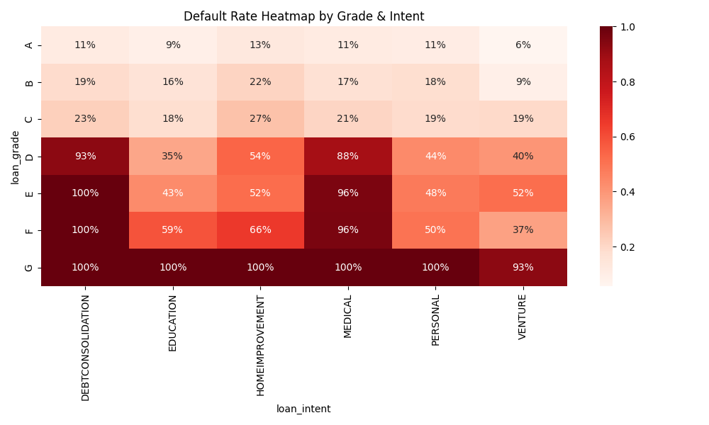
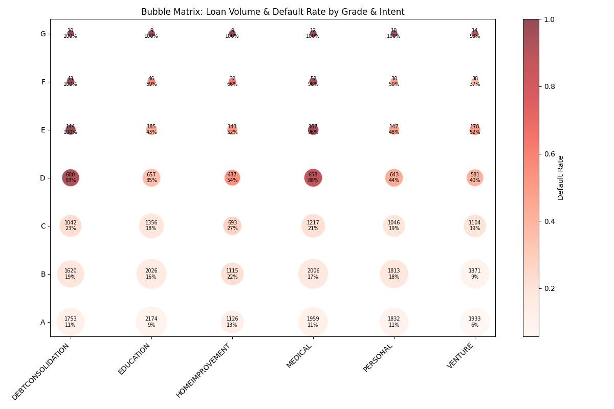
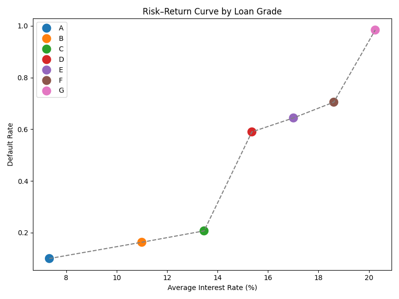
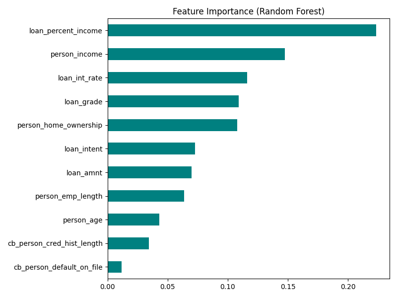

# Credit Risk Analysis - Week 5 Major Assignment (Updated Week 3 Assignment)


**Student**: Diwas Puri  
**Course**: Data Engineering Systems | IDS 706.01.Fa25  
**Dataset**: Credit Risk Dataset  
**Primary Algorithm**: Random Forest Classifier  

---

## 🎯 Project Overview

This project analyzes credit risk using a dataset of 32,581 loan applications to predict loan defaults.  
It demonstrates **data exploration, visualization, feature engineering, and machine learning** with a focus on clean **refactoring** and modular design.

---

## 📋 Assignment Requirements Covered

✅ **Import Dataset** – Load and verify credit risk data  
✅ **Inspect Data** – Exploratory data analysis  
✅ **Basic Filtering and Grouping** – Risk segmentation and statistics  
✅ **Machine Learning Algorithm** – Random Forest classification model  
✅ **Visualization** – Multiple charts showing key insights  
✅ **Refactoring** – Isolated plotting module (`plotting.py`) and utility functions (`analysis_utils.py`) to avoid circular imports  

---

## 📊 Dataset Information

- **Size**: 32,581 loan applications  
- **Features**: 12 columns (demographics, loan details, credit history)  
- **Target Variable**: `loan_status` (0 = No Default, 1 = Default)  
- **Default Rate**: 21.82%  
- **Missing Data**: Employment length (895 missing), Interest rate (3,116 missing)  

---

## 🏗️ Key Features

| Feature | Description | Type |
|---------|-------------|------|
| `person_age` | Age of borrower | Numeric |
| `person_income` | Annual income | Numeric |
| `person_home_ownership` | Home ownership status | Categorical |
| `person_emp_length` | Employment length in years | Numeric |
| `loan_intent` | Purpose of loan | Categorical |
| `loan_grade` | Loan grade (A–G) | Categorical |
| `loan_amnt` | Loan amount requested | Numeric |
| `loan_int_rate` | Interest rate (%) | Numeric |
| `loan_status` | **Target**: Default status (0/1) | Binary |
| `loan_percent_income` | Loan as % of income | Numeric |
| `cb_person_default_on_file` | Previous default history | Binary |
| `cb_person_cred_hist_length` | Credit history length | Numeric |

---

## 📁 Project Structure

```text
IDS706-W2/
├── data/
│   └── credit_risk_dataset.csv
├── charts/                     # auto-created, stores all plots
├── analysis_utils.py           # shared helper functions (grouping, filtering, etc.)
├── plotting.py                 # visualization functions (core + advanced)
├── credit_risk_pandas_refactored.py   # main orchestration script
├── README.md
└── requirements.txt
```


## 📊 Visualizations

- **Default Rate Heatmap** – default rates by loan grade & intent  
  

- **Bubble Matrix** – loan volume + default rate by grade & intent  
  

- **Risk–Return Curve** – tradeoff between average interest rate and default rate  
  

- **Sankey Flow (Intent → Grade → Status)** – interactive HTML chart  
  👉 [View interactive Sankey diagram](https://htmlpreview.github.io/?https://raw.githubusercontent.com/androidilicious/IDS706-W2/refs/heads/main/charts/sankey_flow.html)

- **Correlation Network** – graph of numeric features linked by strong correlations  
  

- **Feature Importance (Random Forest)** – most influential features driving default predictions  
  

---

## 🏆 Model Performance

| Metric | Random Forest | Baseline |
|--------|---------------|----------|
| **Accuracy** | **93.0%** | 78.2% |

---

## 📚 Methodology

### Data Preprocessing
1. **Missing Value Treatment** – median imputation  
2. **Categorical Encoding** – label encoding for ML compatibility  
3. **Data Validation** – no nulls or infinities  
4. **Train/Test Split** – 80/20 stratified  

### Model Development
- **Algorithm**: Random Forest  
- **Rationale**: Handles mixed data types, interpretable via feature importance  
- **Evaluation**: Accuracy  

---

## ⚖️ Disclosure

Due to the author’s developing knowledge in ML, **Claude Sonnet 4.0** was used to generate code snippets and best practice guidance.  
All analysis, interpretations, and insights were reviewed and validated by the author.

---

*Last Updated: September 29 2025 | Week 5 Major Assignment*
